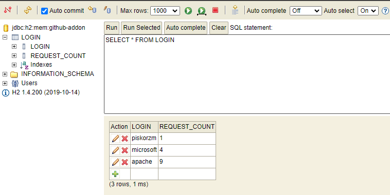

# Github addon service

## What it does?

This simple service has only one endpoint: ``` /users/{login} ```. \
It retrieves user information from Github, deserializes it and furthers it with an additional 'calculation' field.
If the requested user exists it also keeps track of how many times a certain login was requested. Otherwise, it returns 404.

Example request: ``` http://127.0.0.1:8080/users/piskorzm ```

Returns:
```
{
  "id": 29603920,
  "login": "piskorzm",
  "name": "Marcin Piskorz",
  "type": "User",
  "avatarUrl": "https://avatars.githubusercontent.com/u/29603920?v=4",
  "createdAt": "2017-06-21T13:44:49Z",
  "calculations": 27.0
}
```

and stores the given login in the database with the current count: \


## How to run it?

Use to start the service:
```
mvn install
mvn spring-boot:run
```

Use to run tests:
```
mvn test
```

You can also use your IDE.

## How to access the database?

This project uses an in memory H2 database. \
To open the console run the project and go to: http://127.0.0.1:8080/h2-console \
Then use the following settings: \

```
Driver Class: org.h2.Driver
JDBC URL: jdbc:h2:mem:github-addon
User Name: sa
Password: 
```
